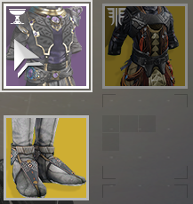
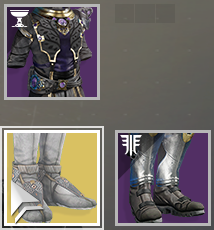

# Macros for Destiny 2

한국어 매뉴얼은 [여기](readme-ko.md)를 클릭하세요.

> DISCLAIMER: Use at your own risk. I do not take any responsibility for any consequences caused by the users who use this. There's no guarantee that you don't get BANNED by Bungie if you use this. Please see this [related issue](https://github.com/preco21/destiny-macros/issues/4#issue-990956216) first before you proceed.

This repository contains a collection of AutoHotKey macros for proof of concept of automating the game mechanisms.

You may need to remap your keyboard mapping if this conflicts with it.

**Also read:** https://www.reddit.com/r/destiny2/comments/96dbcm/macro_usage/

## Usage

- Install [AutoHotKey](https://www.autohotkey.com) `v1.1.30+`.
- Download the file you want by doing:
  - Right click on the filename below the headers.
  - Click `"Save link as..."`.
- Double-click the file to run.

## Jump to
- [AFK](#afk)
- [Flying That Class](#flying-that-class)
- [Full Auto Trigger System](#full-auto-trigger-system)
- [Give Me Some Mod Components](#give-me-some-mod-components)
- [Mirror Ball](#mirror-ball)
- [Panic Button](#panic-button)
- [Smart Shopper](#smart-shopper)
- [The Mountain Top Spammer](#the-mountain-top-spammer)
- [Warlock Fit Changer](#warlock-fit-changer-for-cycling-lunafaction-boots--phoenix-protocol)
- [Warlock Icarus Dash Chaining](#warlock-icarus-dash-chaining)

## Collection

### Flying That Class

[`flying-that-class.ahk`](https://github.com/preco21/destiny-macros/raw/master/flying-that-class.ahk)

> That Class is Korean Destiny meme for Titans who always ace the Crucible with  melee dash.

This enables Titans to fly through the air without losing the height where they jumped from.

You will need some setup for this before you start:

- `(Exotic) Lion Rampant`
- `(Jump) Catapult Lift`
- `Sword`

**Demo:** https://www.youtube.com/watch?v=5HM11GzQldI

**Special thanks to:** https://youtu.be/0R5Rf3D93i0

#### Keys & Usage

Start from the ground, hold sword and sprint forward to where you want to fly. Then press <kbd>Z</kbd>.

- <kbd>Z</kbd>: Start Flying
- <kbd>F2</kbd>: Toggle Macro On/Off

### Warlock Fit Changer (for cycling Lunafaction Boots <> Phoenix Protocol)

[`warlock-fit-changer.ahk`](https://github.com/preco21/destiny-macros/raw/master/warlock-fit-changer.ahk)

> Works on FHD(1920x1080) resolution

This enables you to quickly switch your armors between `Lunafaction Boots` with `Phoenix Protocol` for the best performance of using _Well of Radiance_ skill.

You will need to place your armors as below:

While this macro is running actions, it is not recommended to move mouse.

#### Keys & Usage

- <kbd>F2</kbd>: Switch armor from **Lunafaction Boots** to **Phoenix Protocol** then **Phoenix Protocol** to **Lunafaction Boots** respectively.
- <kbd>F3</kbd>: Reset current cycle state (use when it failed to switch the fit correctly).

### Give Me Some Mod Components

[`give-me-some-mod-components.ahk`](https://github.com/preco21/destiny-macros/raw/master/give-me-some-mod-components.ahk)

> Works on FHD(1920x1080) resolution

Believe or not, Destiny 2 has weird mechanisms that yields you `Mod Components` when you dismantle certain _blue_ items (1~3 component per 9 dismantles).

This automates the procedure when you come to replicate it.

**A post about this mechanism**: https://www.reddit.com/r/DestinyTheGame/comments/9ww38z/mod_component_farm_from_collections/

You will need some resources before you start:

- `Glimmer`
- `Weapon Parts`
- `Unlocked: HARSH LANGUAGE (special ammo grenade launcher)`
- `Location: Orbit (not required, but safe)`

**Caution:** You must empty energy weapon inventory, which mean all 9 blue weapons created will consume every energy weapon item slot.

#### Keys & Usage

- <kbd>F2</kbd>: Start making `Mod Componments`.
- <kbd>F3</kbd>: Stop making `Mod Components` (will stop after finishing the current cycle).

### The Mountain Top Spammer

[`mt-spammer.ahk`](https://github.com/preco21/destiny-macros/raw/master/mt-spammer.ahk)

In Shadowkeep update, Bungie made huge nerf to something called **auto reloading**. Yet, somebody found a technique called **reload skipping** which can be applied to the weapon `The Mountain Top` to fire rounds about `25%` faster than normal.

To replicate the mechanism:

1. Trigger `primary attack`.
2. Trigger `reload` rapidly right after the shooting.
3. Rapidly send `primary attack` for multiple times until it shoots next round.
4. Repeat.

This automates the steps described above.

**Demo:** https://www.youtube.com/watch?v=xLB1yclTNUk

#### Keys & Usage

- <kbd>Middle Mouse Button</kbd>: Start a `fire-reload` loop while pressed
- <kbd>F2</kbd>: Toggle Macro On/Off

### Mirror Ball

[`mirror-ball.ahk`](https://github.com/preco21/destiny-macros/raw/master/mirror-ball.ahk)

> `¯\_(ツ)_/¯`

[Watch this](https://www.youtube.com/watch?v=oAwm2kJs3wA).

This affacts other users who are not in your fireteam.

Requirments:

- `Sword`
- `Location: Tower`

**Note:** Bungie server may kick you out from the social space if you use it much.

**Watch Out:** Somebody can report you for dazzling their eyes.

#### Keys & Usage

- <kbd>F2</kbd>: Start `Mirror Ball`
- <kbd>F3</kbd>: Stop `Mirror Ball`

### Full Auto Trigger System

[`full-auto-trigger-system.ahk`](https://github.com/preco21/destiny-macros/raw/master/full-auto-trigger-system.ahk)

[You know what it does](https://www.light.gg/db/items/4267945040/full-auto-trigger-system/).

#### Keys & Usage

- <kbd>Left Mouse Button</kbd>: Start a loop that trigger `left click` every 0.1 ~ 0.3 second automatically
- <kbd>ALT</kbd>+<kbd>Right Mouse Button</kbd>: Toggle Macro On/Off

### Smart Shopper

[`smart-shopper.ahk`](https://github.com/preco21/destiny-macros/raw/master/smart-shopper.ahk)

This is utility for buying items in bulk manor.

Well, `bulk-buy` stuff should be implemented by Bungie itself though.

#### Keys & Usage

- <kbd>ALT</kbd>+<kbd>`</kbd>: Toggle off below combinations.
- <kbd>ALT</kbd>+<kbd>1</kbd>: Start a loop where it presses the left mouse button for 2 seconds then release.
- <kbd>ALT</kbd>+<kbd>2</kbd>: Start a loop where it rapidly clicks the left mouse button (good for token exchange).
- <kbd>ALT</kbd>+<kbd>3</kbd>: Start a loop where it presses F for 2 seconds (good for dismantling items).

### Panic Button

[`panic-button.ahk`](https://github.com/preco21/destiny-macros/raw/master/panic-button.ahk)

Immediately quits the game when triggered.

This is useful when you are doing flawless run such as `Petra's Run`.

#### Keys & Usage

- <kbd>~</kbd>: When activated, it immediately closes the game by triggering `ALT`+`F4` internally.

### AFK

[`afk.ahk`](https://github.com/preco21/destiny-macros/raw/master/afk.ahk)

This script allows you to afk in certain activities by periodically providing left and right movement inputs. Adjust `movementInterval` and `stopInterval` timings according to your needs.

#### Keys & Usage

- <kbd>Alt</kbd>+<kbd>A</kbd>: Start the script
- <kbd>F3</kbd>: Toggle Macro On/Off

### Warlock Icarus Dash Chaining

[`warlock-icarus-dash-chaining.ahk`](https://github.com/preco21/destiny-macros/raw/master/warlock-icarus-dash-chaining.ahk)

This allows Warlocks to chain two Icarus Dash back-to-back and move very quickly.

#### How to use:

- Equip Warlock's top-tree Dawnblade: Attunement of Sky with Burst Glide jump.
- Press <kbd>F2</kbd> to toggle the script.
- While sprinting, press <kbd>Z</kbd> to activate a Icarus Dash chain (Keep holding <kbd>W</kbd>, i.e, moving forward)

#### Note

- Works only on relatively flat ground more or less.
- Equip sword while dashing to prevent first-person to third-person switch, and subjectively prevent nausea :smiley:
- The script needs to activate second dash right as the character touches the ground after the first dash, so you might need to adjust the `secondDashDelay` to achieve that. It usually depends on your mobility and any other extra perks, like the exotic Transversive Steps or a light weight frame weapon. The default value is set to `1050` ms which should be just fine for a Tier 6 - Tier 9 Mobility Warlock. To adjust it the thumb rule is: higher the Tier, more the delay value.

## FAQ

### Not working! This is bull$h!t

These may not work as expected since it only tested in Korean version of Destiny 2.

Feel free to fork it and modify. PR's welcome.

### 한국어 매뉴얼 없음?

:point_right: [여기](readme-ko.md)

## License

[MIT](https://preco.mit-license.org)
